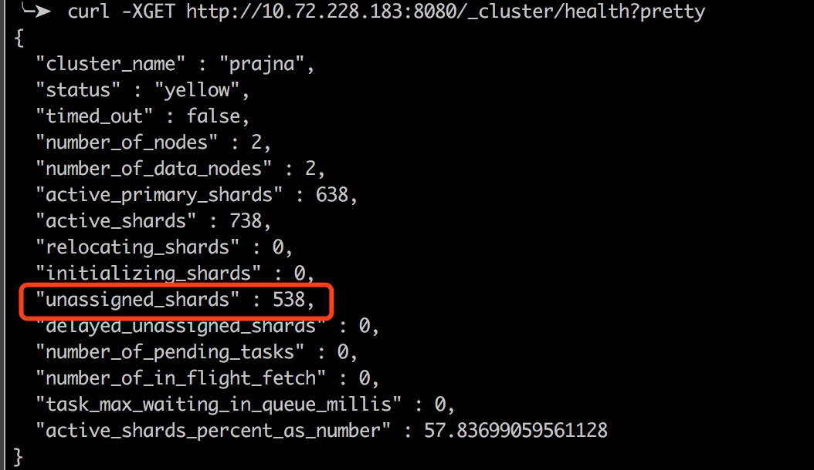
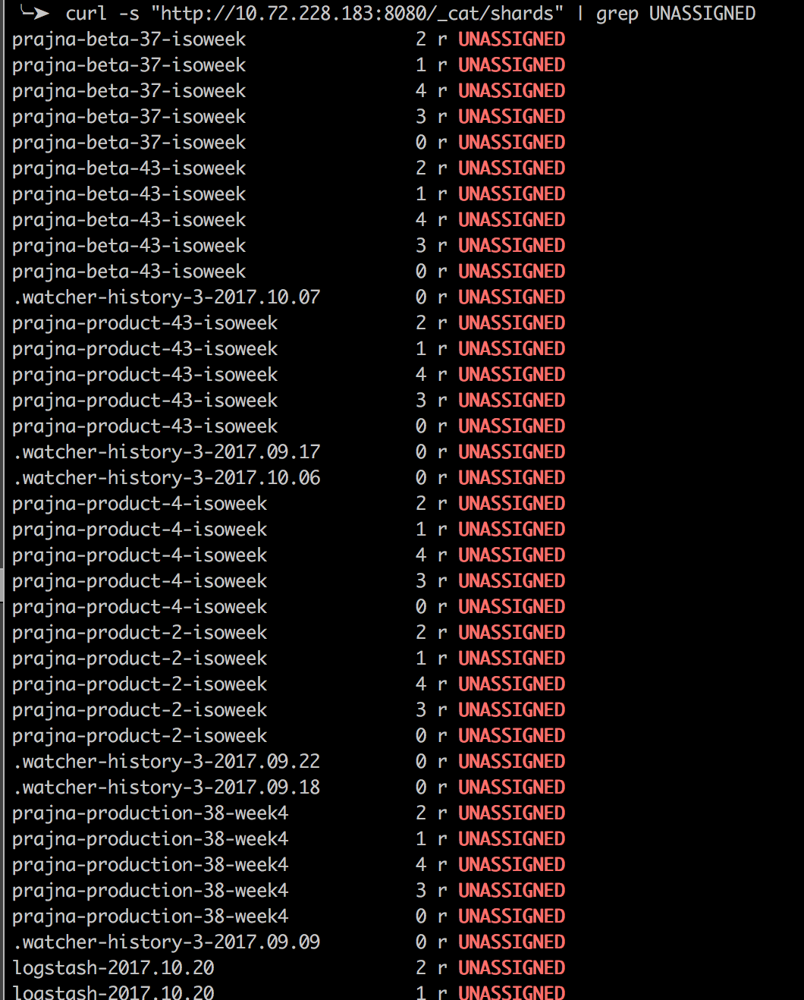
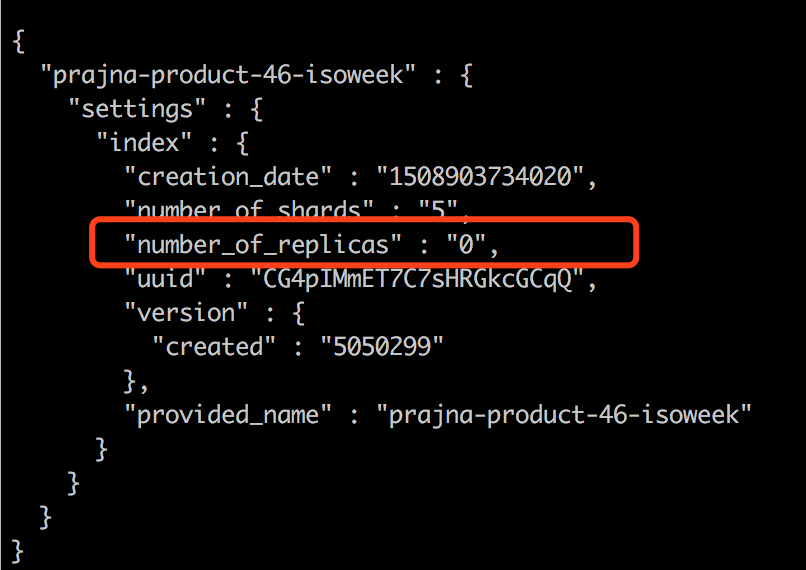

## 查看集群健康度
```
curl -XGET http://xx.xx.xx.xx:xxxx/_cluster/health?pretty
```
或者直接在kibana上看

## 查看各个索引的健康度
在kibana → monitoring → indices 中查看索引的状态，或者通过curl查看
```
curl GET http://xx.xx.xx.xx:xxxx/_cluster/health?level=indices
```
## 健康状态
* red：部分索引的主分片不可用（unassigned）
* yellow：部分索引的副分片不可用（unassigned）

## 为什么要解决 unassigned 分片
* 首先，主分片不可用，会影响正常的索引等功能。
* 另外，ES集群会自动均衡各个节点上的分片数量，但是前提条件是集群中的所有分片都是可用的，即不存在unassigned分片。

## 解决方案：
如果是无关紧要的索引（比如测试的数据等），直接删掉索引就行
```
curl -XDELETE 'http://xx.xx.xx.xx:xxxx/index_name'
```
否则只能手动分配分片

## 分配分片：
```
// 查看所有节点的不可用分片
curl -s "http://10.72.228.183:8080/_cat/shards" | grep UNASSIGNED
```

一列表示索引名，第二列表示分片编号，第三列p是主分片，r是副分片

### 方法一：reroute 分片
```
curl -XPOST 'http://10.72.228.183:8080/_cluster/reroute?pretty' -H 'Content-Type: application/json' -d '{
    "commands":[{
        "allocate_replica":{
            "index":"prajna-product-46-isoweek",
            "shard":0,
            "node":"prajna-hunt-node-web-ppe03.yp"
        }
    }]
}'
```
ps：如果执行失败，可以看看具体是什么原因导致的，如果是副分片不可用，则考虑采用其他办法。

### 方法二：修改 number_of_replicas
查看索引未分配分片的情况
```
curl -XGET 'http://10.72.228.183:8080/_cat/shards/prajna-product-46-isoweek'
```
修改number_of_replicas 为0，删除无用的副分片
```
curl -XPUT 'http://10.72.228.183:8080/prajna-product-46-isoweek/_settings' -d '{"index":{"number_of_replicas":0}}'

```
查看索引的配置信息，确认副本数量变为0了
```
curl -XGET 'http://10.72.228.183:8080/prajna-product-46-isoweek/_settings?pretty'
```


考虑到副本的优化情况，建议在做该操作的同时，做一次段合并。以节约空间和减少文件句柄数。
```
curl -XPOST 'http://10.72.228.183:8080/prajna-product-46-isoweek/_forcemerge?max_num_segments=1'
```
将 number_of_replicas 改为1，将会重新创建一份分片的副本
```
curl -XPUT 'http://10.72.228.183:8080/prajna-product-46-isoweek/_settings' -d '{"index":{"number_of_replicas":1}}'
```
再查看节点的分片状态，会发现都变正常啦，可以通过curl查看，或者直接去kibana查看。如果还是没有正常，参考方法三
```
curl -XGET 'http://10.72.228.183:8080/_cat/shards/prajna-product-46-isoweek'
```

### 方法三：reindex 重建索引
```
curl -XGET 'http://10.72.228.183:8080/_reindex' -d
  '{
    "source": {
      "index": "prajna-product-46-isoweek"
    }
    , "dest": {
      "index": "prajna-product-46-isoweek-new",
      "version_type": "external"
    }
  }'
```
然后删除原来的索引,如果需要索引名与之前一致，则将现有索引增加一个别名即可
```
curl -XPUT 'http://10.72.228.183:8080/prajna-product-46-isoweek-new/_alias/prajna-product-46-isoweek'
```
