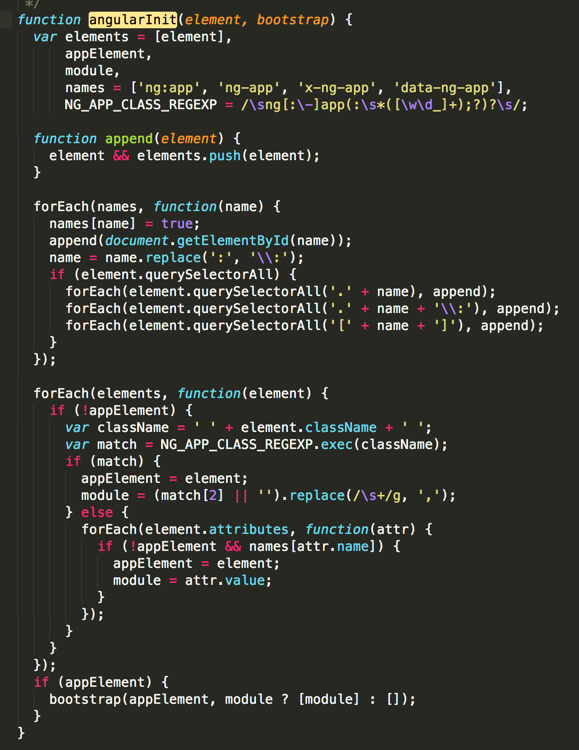

# 启动方式
## 方式一：自动启动
angular找到ng-app，将它作为启动点
```
//html
<!doctype html>
<html ng-app="myModule">
<head>
    <title>angular自启动</title>
    <meta charset="utf-8">
</head>
<body>
    <div ng-controller="myCtrl">{{name}}</div>
</body>
</html>

//js
var app = angular.module('myModule', [])
    .controller('myCtrl',['$scope', function ($scope){
        $scope.name = "chen";
    }]);
```
## 方式二：手动启动
没有ng-app的时候，在js里加一段注册代码
```
//html
<!doctype html>
<html>
<head>
    <title>angular自启动</title>
    <meta charset="utf-8">
</head>
<body>
    <div ng-controller="myCtrl">{{name}}</div>
</body>
</html>


//js
var app = angular.module('myModule', [])
    .controller('myCtrl',['$scope', function ($scope){
        $scope.name = "chen";

    }]);

angular.bootstrap(document, ['myModule']);
```
## 方式三：多个ng-app
> ng-app无法嵌套使用，在非嵌套的情况下使用多个ng-app，默认会启动第一个，后面的都需要手动启动
> （ps:在使用了ng-app的情况下，不要手动启动第一个，虽然可以运行，但是会抛出异常，如图）

> （都不使用ng-app，全部手动启动也是ok的）


```
//html
<!doctype html>
<html>
<head>
    <title>angular自启动</title>
    <meta charset="utf-8">
</head>
<body>
    <div id="app1" ng-app = "test1">
        <div ng-controller="myCtrl">{{name}}</div>
    </div>
    <div id="app2" ng-app = "test2">
        <div ng-controller="myCtrl2">{{age}}</div>
    </div>
</body>
</html>

//js
var app = angular.module('test1', [])
    .controller('myCtrl',['$scope', function ($scope){
        $scope.name = "chen";
    }]);
var app = angular.module('test2', [])
    .controller('myCtrl2',['$scope', function ($scope){
        $scope.age = 20;
    }]);
    angular.bootstrap(app2, ['test2']);    //手动启动第二个ng-app，作用域为id为app2的地方

```
# 启动过程
从代码上来看，大致分四步，下面详细介绍每一步

## 步骤一：暴露全局对象angular
1.如果window.angular不为空，则把它的值赋给全局对象angular，否则用空对象赋值给它。

2.判断是否多次加载，若是多次加载，则抛出异常

## 步骤二：bindJQuery()，绑定jquery，若jquery无法获取，则绑定 angular自己封装的JQLite

jqLite is a tiny, API-compatible subset of jQuery that allows Angular to manipulate the DOM in a cross-browser compatible way.
（jqLite是jquery的一个轻量级的子集。是angular自己实现的，在jquery获取不到时，就会获取JQLite）
## 步骤三：publishExternalAPI(angular)，定义了各种方法（bootstrap，copy,foreach等等），引入angular的一些工具模块（ng模块，ngLocale模块）

## 步骤四：启动
查找ng-app（可是ng-app，ng:app，x-ng-app，data-ng-app）,获取它的启动的根元素(例如最上面的<div id="app1" ng-app = "test1">，此时这个div就是根元素)，然后调用bootstrap()。

若没有找到，那就是手动启动的（angular.bootstrap(...)）,此时appElement被指定了，就能直接调用bootstrap()了

来看看bootstrap()函数

执行doBootstrap()后，返回了injector对象，那再来看看injector对象是啥吧

创建了一个注入器

（注入器（injector）:在依赖注入的模式下，所有的组件必须通过容器才能相互访问，这导致了在AngularJS中， 你必须通过一个中介才能获得某个组件的实例对象,这个中介，就是依赖注入模式中的容器，在AngularJS中，被称为注入器。）

调用invoke函数，注入依赖。调用compile服务（处理一些指令）。

