# 背景
代码的复杂度是评估一个项目的重要标准之一。较低的复杂度既能减少项目的维护成本，又能避免一些不可控问题的出现。然而在日常的开发中却没有一个明确的标准去衡量代码结构的复杂程度，大家只能凭着经验去评估代码结构的复杂程度，比如，代码的程度、结构分支的多寡等等。当前代码的复杂度到底是个什么水平？什么时候就需要我们去优化代码结构、降低复杂度？这些问题我们不得而知。
因此，我们需要一个明确的标准去衡量代码的复杂度。
# 衡量标准
Litmus 是美团点评点餐事业部建设的一个代码质量检测系统，目前包括代码的风格检查、重复率检查以及复杂度检查。litmus 采用代码的Maintainability（可维护性）来衡量一个代码的复杂度，并且通过以下三个方面来定义一段代码的 Maintainability 的值：
* Halstead Volume（代码容量）
* Cyclomatic Complexity（圈复杂度）
* Lines of Code（代码行数）

根据这三个参数计算出 Maintainability，也就是代码的可维护性，公式如下：（[来源](https://blogs.msdn.microsoft.com/codeanalysis/2007/11/20/maintainability-index-range-and-meaning/)）
```
Maintainability Index = MAX(0,(171 - 5.2 * ln(Halstead Volume) - 0.23 * (Cyclomatic Complexity) - 16.2 * ln(Lines of Code))*100 / 171)
```
代码行数不做赘述，下面我们具体介绍代码容量、圈复杂的含义以及它们的计算原理
# Halstead Volume（代码容量）
代码的容量关注的是代码的词汇数，我们抛出以下几个基本概念
| 参数    |  含义  |
| -------| -----  |
| n1     | Number of unique operators，不同的操作元（运算子）的数量 |
| n2     | Number of unique operands，不同的操作数（算子）的数量 |
| N1     | Number of total occurrence of operators，为所有操作元（运算子）合计出现的次数 |
| N2     | Number of total occurrence of operands，为所有操作数（算子）合计出现的次数|
| Vocabulary     |n1 + n2，词汇数 |
| length     | N1 + N2，长度 |
| Volume     |  length * Log2 Vocabulary，容量 |

一个例子

```
function tFunc(opt) {
    let result = opt + 1;
    return result;
}
// n1：function，let，=，+，return
// n2：tFunc，opt，result，1
// N1： function，let，=，+，return
// N2：tFunc，opt，result，opt，1，result
// Vocabulary = n1 + n2 = 9
// length = N1 + N2 = 11
// Volume =  length * Log2 Vocabulary = 34.869
```
# Cyclomatic Complexity（圈复杂度）
## 概念
圈复杂度（Cyclomatic complexity，简写CC）也称为条件复杂度，是一种代码复杂度的衡量标准。由托马斯·J·麦凯布（Thomas J. McCabe, Sr.）于1976年提出，用来表示程序的复杂度，其符号为VG或是M。它可以用来衡量一个模块判定结构的复杂程度，数量上表现为独立现行路径条数，也可理解为覆盖所有的可能情况最少使用的测试用例数。圈复杂度大说明程序代码的判断逻辑复杂，可能质量低且难于测试和 维护。程序的可能错误和高的圈复杂度有着很大关系。
## 如何计算
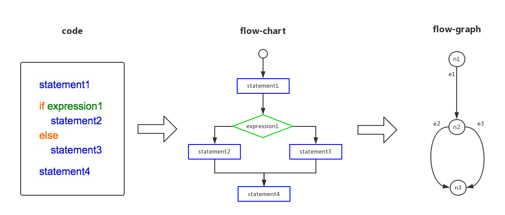

如果在控制流图中增加了一条从终点到起点的路径，整个流图形成了一个闭环。圈复杂度其实就是在这个闭环中线性独立回路的个数。

如下图，线性独立回路有：

* e1→ e2 → e
* e1 → e3 → e

所以复杂度为2

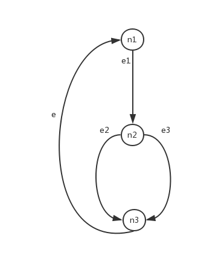
## 计算公式
```
V(G) = e – n + 2 * p
```

* e：控制流图中边的数量（对应代码中顺序结构的部分）
* n：代表在控制流图中的判定节点数量，包括起点和终点（对应代码中的分支语句）
    * ps：所有终点只计算一次，即使有多个 return 或者 throw
* p：独立组件的个数

## 几种常见的语句控制流图
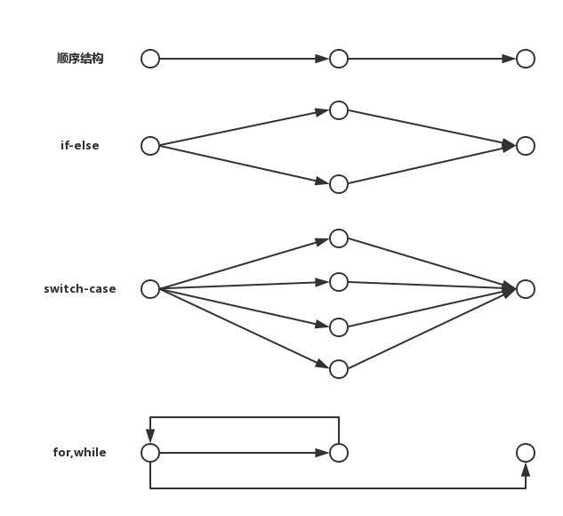

## 一个例子
code:
```
function test(index, string) {
       let returnString;
       if (index == 1) {
           if (string.length < 2) {
              return '分支1';
           }
           returnString = "returnString1";
       } else if (index == 2) {
           if (string.length < 5) {
              return '分支2';
           }
           returnString = "returnString2";
       } else {
          return  '分支3'
       }
       return returnString;
}
```

flow-chart

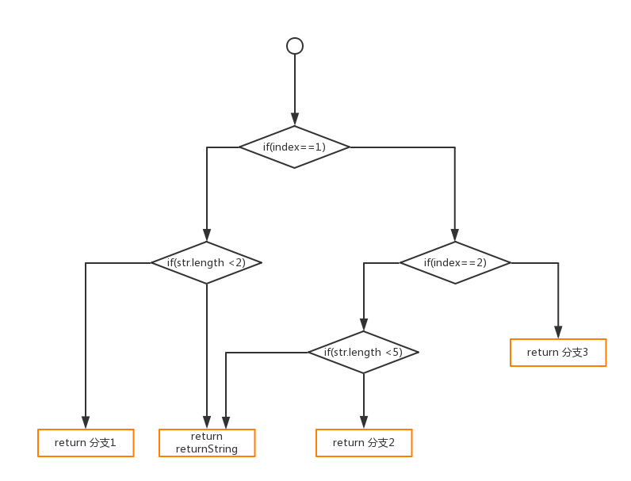

flow-graph

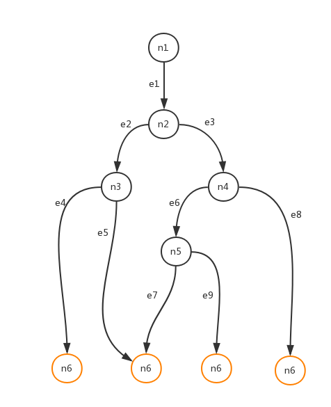

公式：

e（边）：9

n（判定节点）：6

p：1

V = e - n + 2 * p = 5

# 如何优化
## 主要针对圈复杂度
大方向：减少判断分支和循环的使用

（下面某些例子可能举的不太恰当，仅用以说明这么一种方法）

### 提炼函数
```
// 优化前，圈复杂度4
function a (type) {
    if (type === 'name') {
        return `name：${type}`;
    } else if (type === 'age') {
        return `age：${type}`;
    } else if (type === 'sex') {
        return `sex：${type}`;
    }
}


// 优化后，圈复杂度1
function getName () {
    return `name：${type}`;
}
function getAge () {
    return `age：${type}`;
}
function getSex () {
    return `sex：${type}`;
}

```
### 表驱动
```
// 优化前，圈复杂度4
function a (type) {
    if (type === 'name') {
        return 'Ann';
    } else if (type === 'age') {
        return 11;
    } else if (type === 'sex') {
        return 'female';
    }
}


// 优化后，圈复杂度1
function a (type) {
    let obj = {
        'name': 'Ann',
        'age': 11,
        'sex': 'female'
    };
    return obj[type];
}
```

### 简化条件表达式
```
// 优化前，圈复杂度4
function a (num) {
    if (num === 0) {
        return 0;
    } else if (num === 1) {
        return 1;
    } else if (num === 2) {
        return 2;
    } else {
        return 3;
    }
}


// 优化后，圈复杂度2
function a (num) {
    if ([0,1,2].indexOf(num) > -1) {
        return num;
    } else {
        return 3;
    }
}
```
### 简化函数
```
// 优化前，圈复杂度4
function a () {
    let str = '';
    for (let i = 0; i < 10; i++) {
        str += 'a' + i;
    }
    return str
}
function b () {
    let str = '';
    for (let i = 0; i < 10; i++) {
        str += 'b' + i;
    }
    return str
}
function c () {
    let str = '';
    for (let i = 0; i < 10; i++) {
        str += 'c' + i;
    }
    return str
}


// 优化后，圈复杂度2
function a (type) {
    let str = '';
    for (let i = 0; i < 10; i++) {
        str += type + i;
    }
    return str
}
```

# 检测工具
1. 本地检测：[es6-plato](https://github.com/the-simian/es6-plato)
```
npm i es6-plato
es6-plato -x node_modules -r -d report ./   // 具体参数可参照官方文档
```
2. litmus 代码质量检测中心（该系统目前仅限公司内部使用），部分截图如下
首页：

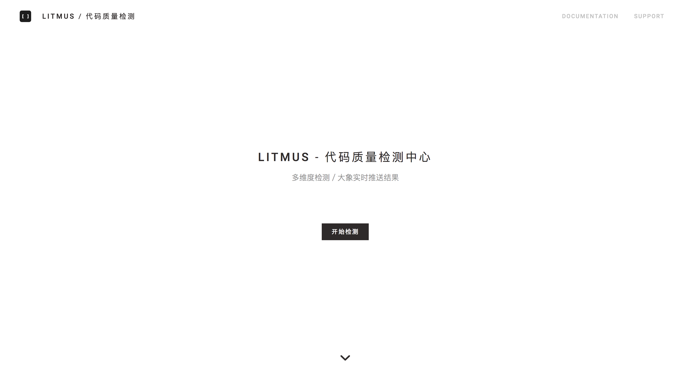
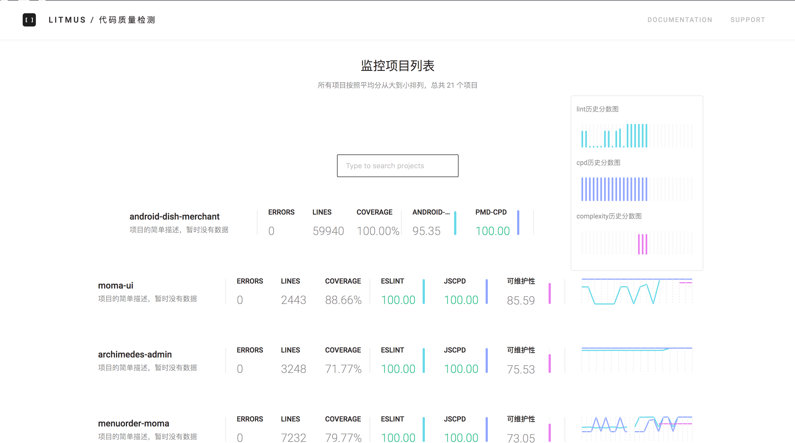

详情页：

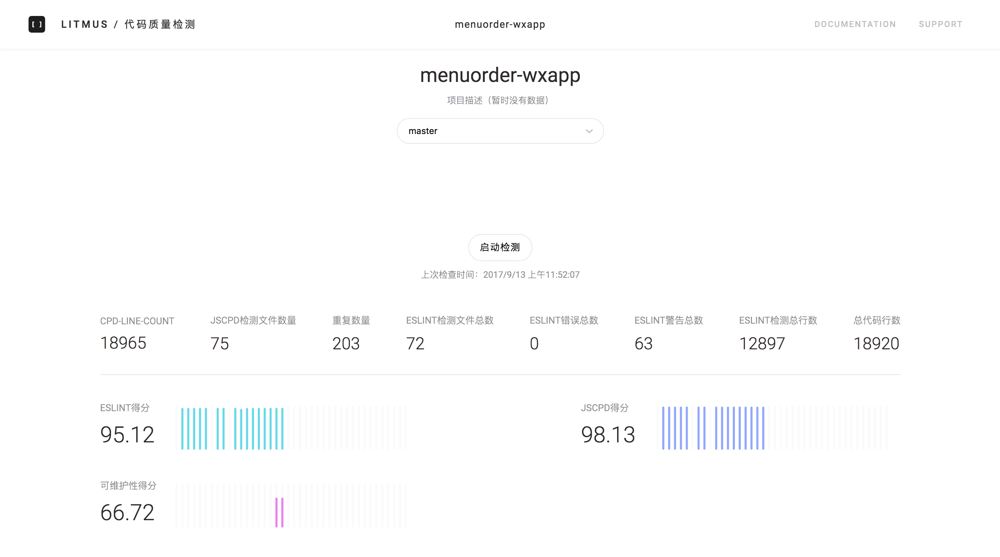
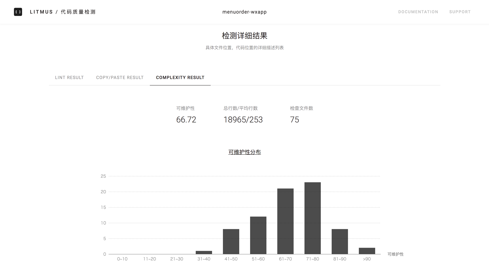
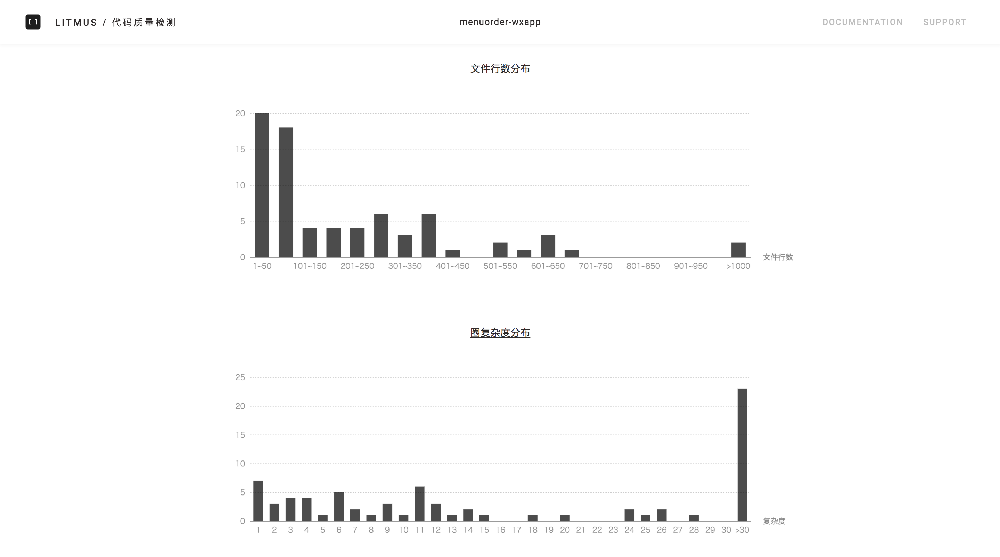
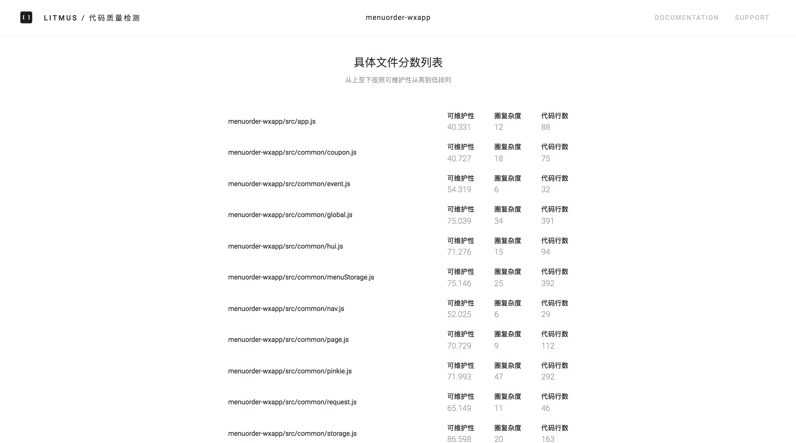


