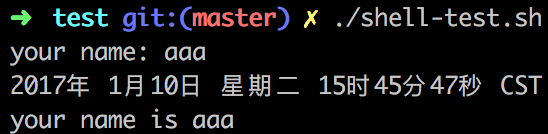
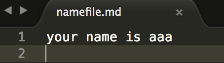
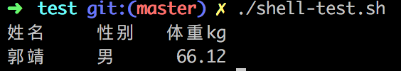

# 基础
## shell && shell script
* shell：一种应用程序，为用户提供了一个界面，用户可以通过这个界面访问操作系统内核的服务。
* shell script：为 shell 编写的脚本程序

## 环境
* 文本编辑器 + 能解释执行的脚本解释器
* ps：shell 的种类较多，在 shell 脚本里需要指定解释此脚本的解释器
* Linux：自带 shell 解释器
* mac os：不仅带 sh、bash 这两个最基础的解释器，还内置了ksh、csh、zsh等不常用的解释器
* windows：没有内置 shell 解释器，需要自行安装

## 实例
```
#! /bin/bash  # 指定解释器
echo "hello"
```
## 执行
```
# 方法一：在脚本里指明解释器
chmod +x ./test.sh   # 使脚本具有执行权限
./test.sh # 执行当前目录下的 test.sh

# 方法二：运行时指明解释器
/bin/sh test.sh
/bin/php test.sh
```
# 变量
* 变量名规则：
    * 首字母必须为字母
    * 不允许空格、标点符号以及 bash 里的关键字，可以使用下划线（_）
```
#! /bin/bash
your_name="chen"  # 变量定义不需要使用$符
my_name="a"
echo ${your_name}   # 使用变量需要$符，花括号加不加都行，但是为了帮助解释器识别变量的边界，还是加上
readonly your_name   # 设置只读变量
your_name="chen1" # 试图改变只读变量的值时，会报错
unset my_name # 删除变量，不能删除只读变量
echo ${my_name}  # 输出为空
```

# 字符串
```
#! /bin/bash
my_name='chen'
string1='my name is ${my_name}'   # 单引号里的变量无效
string2="my name is ${my_name}"
length=${#my_name}  # 获取字符串长度
childString=${my_name:1:2}  # 提取从第二个字符开始，长度为2的子串

echo ${string1} # my name is ${my_name}
echo ${string2} # my name is chen
echo ${length}  # 4
echo ${childString} #he
```

# 数组
```
#! /bin/bash
array=(1 2 3 4 5)   # bash 只支持一维数据，不限定数据的大小

echo ${array[0]}  # 1
echo ${array[@]}  # 1 2 3 4 5
echo ${#array[@]}  # 5   获取数组长度
echo ${#array[*]}  # 5   获取数组长度
```
# 基本运算符
```
#! /bin/bash
sum=`expr 2 + 2`  # expr：表达式计算工具，运算符前后要有空格，表达式要被``包含

echo ${sum}  # 4
```

# echo
```
#! /bin/bash
echo -e "your name: \c"    # -e：开启转义，\c：不换行，\n：换行
read name       # 读取输入
read name < file1      # 从文件file中读取内容，赋给变量name
echo `date`    # 当前日期
echo "your name is $name"
echo "your name is $name" > namefile.md    # 结果输出到namefile.md文件中（会覆盖以前的内容）
echo "your name is $name" >> namefile.md   # 输出结果以追加的方式重定向到namefile.md文件中（不会覆盖以前的内容）
```




# printf
* 与 echo 的区别：
    * 使用printf的脚本比使用echo的脚本可移植性抢
    * echo 输出默认换行，printf 需要手动添加换行符 \n

```
#! /bin/bash
# printf 格式化字符串 参数列表
printf "%-10s %-8s %-4s\n" 姓名 性别 体重kg
printf "%-10s %-8s %-4.2f\n" 郭靖 男 66.1234  #-：左对齐，没有表示右对齐
```

# test
用于检测某个条件是否成立，可以进行数值、字符、文件三个方面的测试
# 流程控制
```
# if
if condition
then
    do something
fi

# if else
if condition
then
    do something
else
    do something
fi


# if else-if else
if condition1
then
    do something
elif condition2
then
    do something
else
    do something
fi

# for 循环
for x in item1 item2...itemN
do
    do something
done

# while 语句
while condition
do
    do something
done

# until
until condition
do
    do something
done

# case
case $val in
    val1)
        do something
    ;;
    val2)
        do something
    ;;          # 两个分号表示 break
    val3)
        do something
    ;;
    *)
        do something   # 上面三个都没匹配到时
    ;;
esac


# break
# continue
```

# shell 函数
```
# 定义
#functionName () {
#   do something    # 如果没有return，则把最后一条命令的运行结果作为返回值
#}

# 调用
# functionName 参数列表

testFunction () {
    echo $1   # 输出第一个参数
    echo $2   # 输出第二个参数
    echo $#   # 输出参数个数
    echo $*   # 输出所有参数
}
testFunction aaaa bbbb
```

# shell 文件包含
```
# 格式
. filename

# 或者
source filename
```

